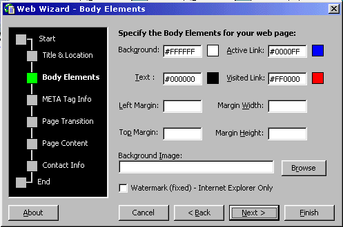



## Web Wizard v3\.36

### Description

Web Wizard v3.36

The award-winning Web Wizard is back with a new, easy-to use interface. It helps you to easily create your own web page in just 6 simple steps. Please watch the screen-shot for a quick peek! Enjoy!!

If you like it, give me a vote...
 
### More Info
 

             |
---                |---
**Submitted On**   |2001-04-14 19:19:32
**By**             |[Md Emran Hasan](https://github.com/Planet-Source-Code/PSCIndex/blob/master/ByAuthor/md-emran-hasan.md)
**Level**          |Intermediate
**User Rating**    |5.0 (10 globes from 2 users)
**Compatibility**  |VB 4\.0 \(32\-bit\), VB 5\.0, VB 6\.0
**Category**       |[Complete Applications](https://github.com/Planet-Source-Code/PSCIndex/blob/master/ByCategory/complete-applications__1-27.md)
**World**          |[Visual Basic](https://github.com/Planet-Source-Code/PSCIndex/blob/master/ByWorld/visual-basic.md)
**Archive File**   |[Web Wizard183584142001\.zip](https://github.com/Planet-Source-Code/md-emran-hasan-web-wizard-v3-36__1-22399/archive/master.zip)

